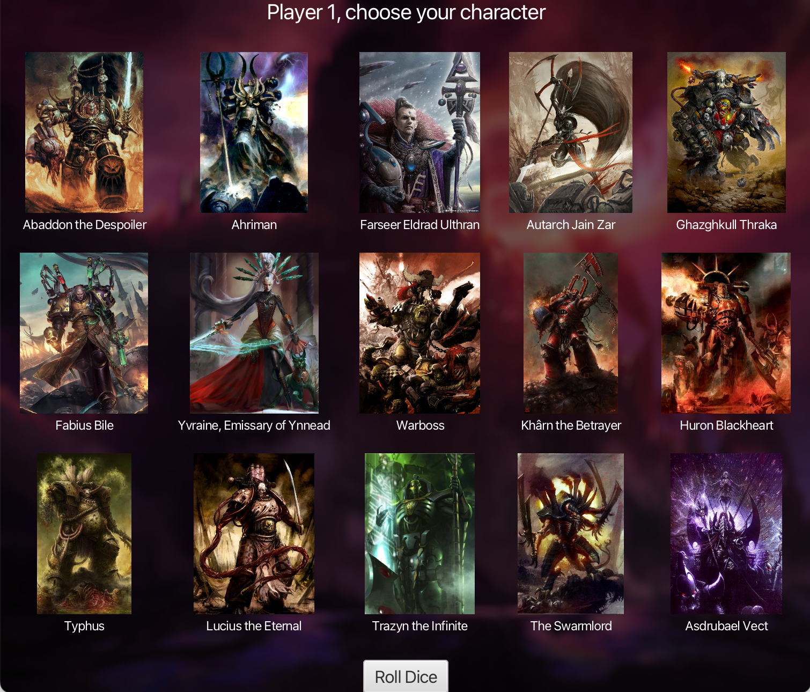
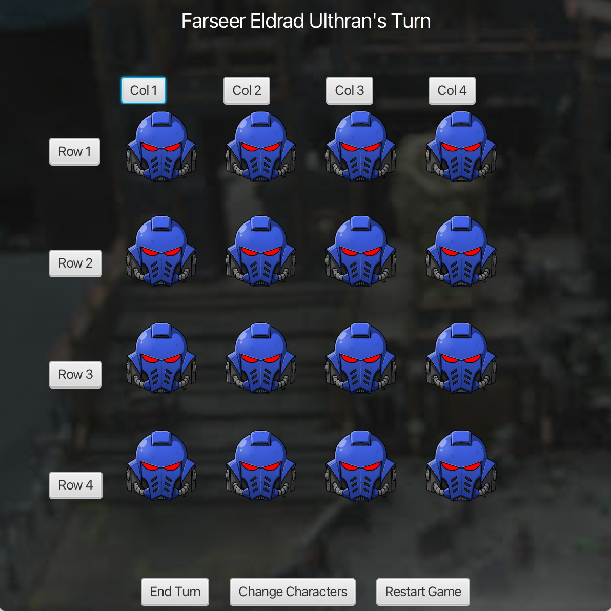

[](https://classroom.github.com/a/f0r53tPY)

# Project 5 (with Warhammer theme)

## Overview

This project is a two-player game where players select characters and then play a game on a 4x4 board. The objective of the game is to be the player who makes the last move by removing stones from the board.

## Game Rules

1. The game board consists of a 4x4 grid of cells, each containing a piece of stone.
2. Players take turns to move.
3. On their turn, a player must choose a non-empty row or column and remove 1 to 4 adjacent stones from it.
4. If 2 or more stones are removed, they must be adjacent.
5. The player who makes the last move (removes the last stone) wins the game.

## Character Selection

Before starting the game, each player selects a character. The character selection is implemented using JavaFX. The available characters are:

- Abaddon the Despoiler
- Ahriman
- Farseer Eldrad Ulthran
- Autarch Jain Zar
- Ghazghkull Thraka
- Fabius Bile
- Yvraine, Emissary of Ynnead
- Warboss
- Khârn the Betrayer
- Huron Blackheart
- Typhus
- Lucius the Eternal
- Trazyn the Infinite
- The Swarmlord
- Asdrubael Vect

Once a character is selected by a player, the corresponding button becomes disabled to prevent the other player from choosing the same character.

## Technologies Used

- **Java**: The core programming language used for the game logic.
- **JavaFX**: Used for creating the graphical user interface (GUI) for character selection and the game board.
- **FXML**: Used for defining the layout of the user interface.
- **SceneBuilder**: A visual layout tool for JavaFX applications (optional).

## How to Run the Project

1. **Clone the Repository**:
   ```sh
   git clone https://github.com/INBPA0420L/homework-project-2024-pouriaafshari
   cd homework-project-2024-pouriaafshari
   ```

2. **Set Up the Environment**:
   Ensure you have JDK 8 or later installed. You can download it from [Oracle's website](https://www.oracle.com/java/technologies/javase-jdk8-downloads.html).

3. **Build the Project**:
   If you're using an IDE like IntelliJ IDEA or Eclipse, open the project and build it. If you prefer to use the command line, navigate to the project directory and run:
   ```sh
   javac -cp . src/**/*.java
   ```

4. **Run the Project**:
   ```sh
   java -cp src main.java.Main
   ```

5. **Using an IDE**:
    - Open the project in your preferred IDE.
    - Navigate to `main.java`.
    - Run the `Main` class.

## What's New

### Latest Version Updates

- **New Characters Added**: The latest version includes new characters like Trazyn the Infinite, The Swarmlord, and Asdrubael Vect, expanding the roster to 15 unique characters.
- **Improved User Interface**: Enhanced the character selection screen with better graphics and smoother transitions.
- **Bug Fixes**: Resolved issues with character selection buttons not disabling correctly and fixed minor bugs in the game logic.

## Screenshots


*Character selection screen where players choose their characters.*


*The game board where players remove stones.*

## Credits

- **Author**: Pouria Afshari
- **License**: This project is licensed under the MIT License.

## Contributing

1. Fork the repository.
2. Create a new branch (`git checkout -b feature-branch`).
3. Commit your changes (`git commit -am 'Add some feature'`).
4. Push to the branch (`git push origin feature-branch`).
5. Create a new Pull Request.

## Acknowledgements

- Thanks to [Oracle](https://www.oracle.com) for providing the Java Development Kit and JavaFX.
- Special thanks to my instructor and peers for their support and feedback.